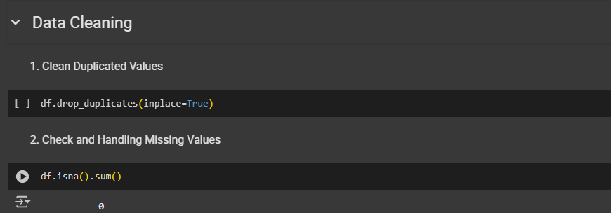
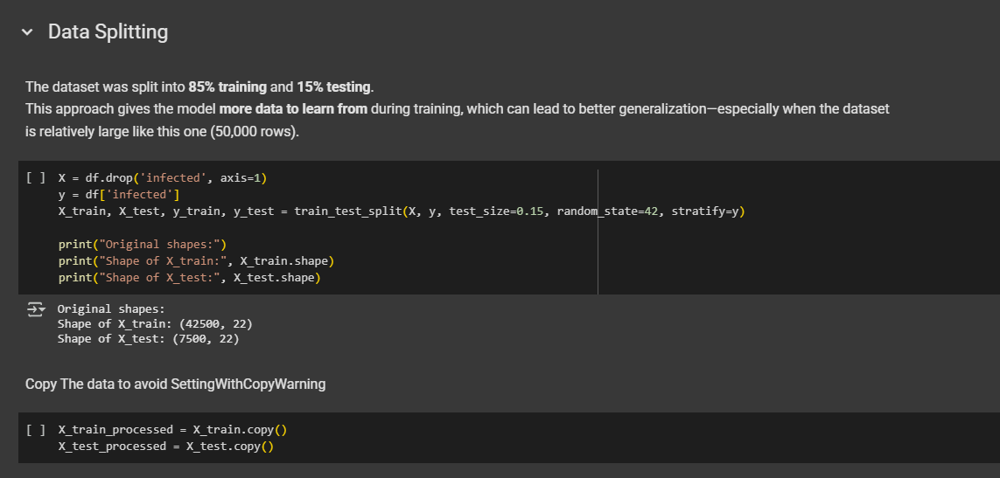
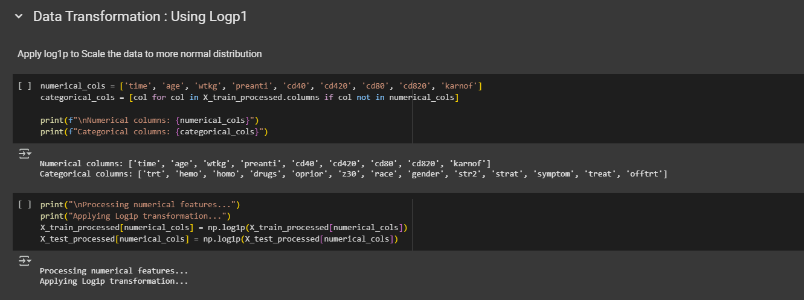
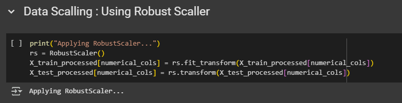

# 🧬 Aids Prediction Using Machine Learning
---
## 📌 Project Domain

**Human Immunodeficiency Virus (HIV)** is a virus that attacks the human immune system, specifically targeting **CD4 cells (T cells)** 🛡️, which are crucial in fighting off infections. If left untreated, HIV can progressively weaken the immune system and lead to **Acquired Immunodeficiency Syndrome (AIDS)** ❌🧫 — a chronic, potentially life-threatening condition marked by severe immune deterioration and opportunistic infections.

📊 According to **UNAIDS (2023)**:
- 🌍 **39.9 million** people were living with HIV globally
- 💊 Only **9.3 million** had access to antiretroviral therapy (ART)
- ⚰️ **630,000 AIDS-related deaths**
- 🧪 **1.3 million new AIDS infections**

In 🇮🇩 **Indonesia**, 2023 data reported:
- 🧾 **57,299 HIV cases** out of **6.14 million** people tested
- ➕ **17,121 newly identified AIDS cases**

⚠️ These numbers likely underrepresent the real situation due to underreporting, undiagnosed cases, and limited access to testing, especially in remote areas.

---
## Business Understanding ❔

The burden of HIV/AIDS remains a major global health challenge. A critical clinical need is to **identify high-risk individuals** living with HIV before they progress to AIDS.

### 🔍 Key Questions:
- 🤔 **How can we accurately predict whether an individual living with HIV is at risk of developing AIDS?**
- 🧠 **How can machine learning be utilized to assist early detection and prevent further transmission within the population?**

### 🎯 Goals

The main goal is to build a **reliable and interpretable machine learning model** 🤖 to support healthcare professionals in:
- 📈 Predicting AIDS progression in PLHIV (People Living with HIV)
- 🩺 Improving clinical decision-making and early intervention

### 🛠️ Solution Statement

To solve the above challenges, we will implement the following steps:

**1️⃣ Model Benchmarking (Baseline Models):**
- 📉 **Logistic Regression (LR)**
- 🌲 **Random Forest (RF)**
- 🚀 **Extreme Gradient Boosting (XGBoost)**

**2️⃣ Hyperparameter Tuning:**
- 🎯 Use **Bayesian Search** to optimize key model parameters

**3️⃣ Evaluation Metrics:**
We will assess each model using:

| Metric        | Description                                      |
|---------------|--------------------------------------------------|
| **Accuracy**  | Correct predictions overall                      | 
| **Precision** | Correct AIDS predictions among predicted cases   | 
| **Recall**    | Ability to detect true AIDS cases                | 
| **F1-Score**  | Balance between precision & recall               | 

---
## Data Understanding ❔
**Data Source:**

Dataset obtained from [AIDS Virus Infection Prediction 💉
](https://www.kaggle.com/datasets/aadarshvelu/aids-virus-infection-prediction/data)

**Data Information:**
* About Data: Dataset contains healthcare statistics and categorical information about patients who have been diagnosed with AIDS. This dataset was initially published in 1996.

* Amount of data: 50,000 rows

* Data format: Tabular (CSV)

**Column Explanation:**

Time and Key Outcome Information:

* **time**: Time until treatment failure or patient is no longer observed in the study (censoring). This is the primary time variable in survival analysis.
* **infected**: AIDS infection status of the patient at the end of the study (0=No, 1=Yes). This can be a target variable in some types of analysis.
* **offtrt**: Indicator of whether the patient stopped treatment before the specified time (0=No, 1=Yes).
---
Treatment Information:

* **trt**: Code indicating the type of antiretroviral treatment received by the patient (0=ZDV only, 1=ZDV+ddI, 2=ZDV+Zal, 3=ddI only).
* **treat**: Simplified version of the treatment indicator (0=ZDV only, 1=others).
* **oprior**: Whether the patient had received non-ZDV antiretroviral therapy before the study (0=No, 1=Yes).
* **z30**: Whether the patient used ZDV in the 30 days before a specific time point in the study (0=No, 1=Yes).
* **preanti**: Number of days the patient had received antiretroviral therapy before a specific time point.
* **str2**: Patient's experience with antiretroviral therapy (0=naive/never, 1=experienced).
* **strat**: Stratification category based on the length of the patient's experience with antiretroviral therapy (1='Antiretroviral Naive', 2='> 1 but <= 52 weeks of prior antiretroviral therapy', 3='> 52 weeks').
---
Personal Information:
* **age**: Patient's age at the start of the study (baseline) in years.
* **wtkg**: Patient's weight at the start of the study (baseline) in kilograms.
* **race**: Patient's race (0=White, 1=non-white).
* **gender**: Patient's gender (0=F/Female, 1=M/Male).
* **homo**: Whether the patient has a history of same-sex sexual activity (0=No, 1=Yes).
---
**Medical History:**
* **hemo**: Whether the patient has hemophilia (blood clotting disorder) (0=No, 1=Yes).
* **drugs**: Whether the patient has a history of illicit drug use by injection (0=No, 1=Yes).
* **symptom**: Whether the patient showed symptoms of illness at the start of the study (0=asymptomatic, 1=symptomatic).
---
Lab Results:

* **karnof**: Karnofsky score, a general measure to assess the patient's level of physical function (scale 0-100, higher is better) at baseline.
* **cd40**: Patient's CD4 cell count at baseline.
* **cd420**: Patient's CD4 cell count around 20 weeks after the start of the study.
* **cd80**: Patient's CD8 cell count at baseline.
* **cd820**: Patient's CD8 cell count around 20 weeks after the start of the study.

---

---

### Data Distribution Summary

#### 1. `Time`

Patients participated in the study for **66 to 1200 days**, with a **left-skewed distribution**.

#### 2. `Age`

Patients aged **10 to 70 years** joined the study, and the distribution is **fairly normal**.

#### 3. `Wktg` (Body Weight)

Patients had body weights ranging from **around 40 kg to over 140 kg**. The distribution is **slightly right-skewed**, though it appears somewhat normal. Since most data falls between **50 and 100 kg**, there are **a number of outliers**.

#### 4. `Preanti`

Use of antiretroviral drugs for pain relief in HIV/AIDS patients. The distribution is **right-skewed** with **many outliers**.

#### 5. `Cd40`

CD4 cell count (immune cells) at **baseline** ranged from **0 to over 800**, with a **fairly normal distribution**.

#### 6. `Cd420`

CD4 cell count **after 20 days** ranged from **above 0 to over 1000**, showing an **increase from baseline** with a **more normal distribution**, though **outliers still exist**.

#### 7. `Cd80`

Baseline CD8 cell count ranged from **0 to over 4000**, with a **right-skewed distribution**.

#### 8. `Cd820`

CD8 cell count **after 20 days** ranged from **above 0 to 3500**, showing a **decrease from baseline** and a **right-skewed distribution**.

#### 9. `Karnof`

Patient health scores ranged from **35 to 100**, with a **left-skewed distribution**.

---

**📋 Categorical Data Summary**

* `Trt`: 37.3% of patients were treated with **ZDV only**.
* `Hemo`: 96.5% of patients **do not have hemophilia**.
* `Homo`: 65% of participants **identify as homosexual**.
* `Drugs`: 86% of participants **do not use drugs**.
* `Oprior`: 95% of participants **did not receive non-ZDV antiretroviral therapy** before.
* `Z30`: 64% of patients **used ZDV in the past 30 days**.
* `Race`: 70% of participants are **White**.
* `Gender`: 85% of participants are **male**.
* `Str2`: 57% of participants **had previous antiretroviral treatment**.
* `Strat`:

  * 43% **never received any treatment**
  * 19% **had treatment for less than 52 weeks**
  * 37% **had treatment multiple times**
* `Symptom`: 91% of patients **reported no symptoms**.
* `Treat`: 73% of patients **used treatments beyond just ZDV**.
* `Offtreatment`: 65% of patients **did not stop treatment before 5 weeks**.
* `Infected`: 69% of participants were **not infected**, while 31% **were infected**.

---
### Conclusion

The dataset mostly shows **non-normal distributions**, and the target classes (**infected vs. not infected**) are **imbalanced**, with way more samples in the non-infected group. This can cause machine learning models to be biased toward the majority class.

To tackle this, I plan to:

- Apply **Log1p transformation** and **Robust Scaler** to handle **outliers** more effectively. These outliers seem like valid values, not random noise or errors, so we don’t want to just drop them.
- Perform **One-Hot Encoding** on categorical columns to make sure the model doesn't misinterpret category values as numeric relationships.
- Use **SMOTE (Synthetic Minority Over-sampling Technique)** to balance the class distribution. This helps reduce bias and gives the model a fair chance to learn from the minority class.

These preprocessing steps are aimed at boosting model performance and making the predictions more fair and reliable.

---
## Data Preparation
During the data preprocessing phase, I applied several important steps to prepare the dataset for modeling:

1. **Data Cleaning**  
   This step involves handling "dirty" data, such as:
   - Removing **duplicate rows** that can bias the model.
   - Checking and handling **missing values**, although in this dataset, missing values were minimal or non-existent.

2. **Data Splitting**  
   The dataset was split into **training and testing sets** *before* any transformation, scaling, or encoding.  
  This is important to avoid **data leakage**, where the model might indirectly learn from the test data (like seeing the answer key).

4. **Data Transformation (Log1p)**  
   Some numerical features had **highly skewed distributions**. To address this, I applied the **Log1p transformation** to reduce skewness and help the model learn better patterns.

5. **Feature Scaling (Robust Scaler)**  
   After transformation, I used **Robust Scaler** for feature scaling.  
   This scaler is less sensitive to **outliers**, which is perfect since our data contains valid extreme values.

6. **One-Hot Encoding**  
   For categorical features, I used **One-Hot Encoding** to avoid misleading the model into thinking that higher category values mean "greater" (e.g., category 3 > 1).  
   This ensures categories are treated equally.

7. **SMOTE (Synthetic Minority Over-sampling Technique)**  
   The target variable (`infected`) was **imbalanced**, with far fewer positive cases.  
   So, I used **SMOTE** to synthetically generate new examples of the minority class, helping the model **learn more fairly** and avoid bias toward the majority class.

