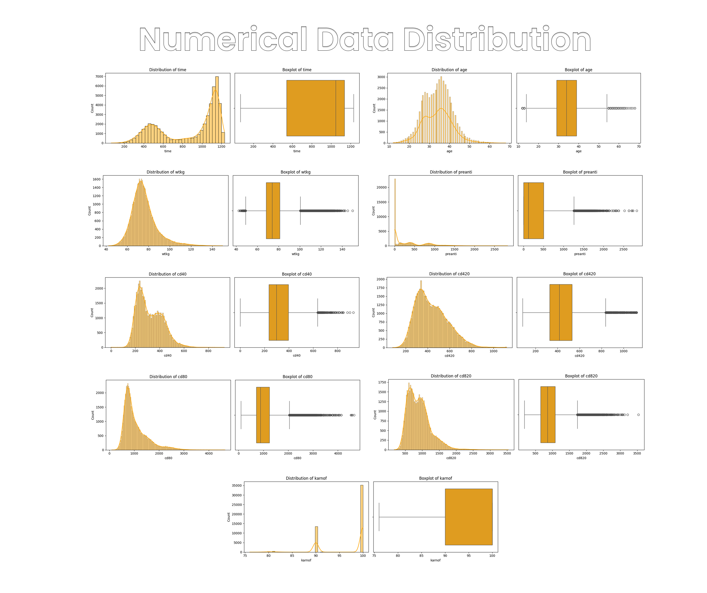

# 🧬 Aids Prediction Using Machine Learning
---
## 📌 Project Domain

**Human Immunodeficiency Virus (HIV)** is a virus that attacks the human immune system, specifically targeting **CD4 cells (T cells)** 🛡️, which are crucial in fighting off infections. If left untreated, HIV can progressively weaken the immune system and lead to **Acquired Immunodeficiency Syndrome (AIDS)** ❌🧫 — a chronic, potentially life-threatening condition marked by severe immune deterioration and opportunistic infections.

📊 According to **UNAIDS (2023)**:
- 🌍 **39.9 million** people were living with HIV globally
- 💊 Only **9.3 million** had access to antiretroviral therapy (ART)
- ⚰️ **630,000 AIDS-related deaths**
- 🧪 **1.3 million new AIDS infections**

In 🇮🇩 **Indonesia**, 2023 data reported:
- 🧾 **57,299 HIV cases** out of **6.14 million** people tested
- ➕ **17,121 newly identified AIDS cases**

⚠️ These numbers likely underrepresent the real situation due to underreporting, undiagnosed cases, and limited access to testing, especially in remote areas.

---
## Business Understanding ❔

The burden of HIV/AIDS remains a major global health challenge. A critical clinical need is to **identify high-risk individuals** living with HIV before they progress to AIDS.

### 🔍 Key Questions:
- 🤔 **How can we accurately predict whether an individual living with HIV is at risk of developing AIDS?**
- 🧠 **How can machine learning be utilized to assist early detection and prevent further transmission within the population?**

### 🎯 Goals

The main goal is to build a **reliable and interpretable machine learning model** 🤖 to support healthcare professionals in:
- 📈 Predicting AIDS progression in PLHIV (People Living with HIV)
- 🩺 Improving clinical decision-making and early intervention

### 🛠️ Solution Statement

To solve the above challenges, we will implement the following steps:

**1️⃣ Model Benchmarking (Baseline Models):**
- 📉 **Logistic Regression (LR)**
- 🌲 **Random Forest (RF)**
- 🚀 **Extreme Gradient Boosting (XGBoost)**

**2️⃣ Hyperparameter Tuning:**
- 🎯 Use **Bayesian Search** to optimize key model parameters

**3️⃣ Evaluation Metrics:**
We will assess each model using:

| Metric        | Description                                      |
|---------------|--------------------------------------------------|
| **Accuracy**  | Correct predictions overall                      | 
| **Precision** | Correct AIDS predictions among predicted cases   | 
| **Recall**    | Ability to detect true AIDS cases                | 
| **F1-Score**  | Balance between precision & recall               | 

---
## Data Understanding ❔
**Data Source:**

Dataset obtained from [AIDS Virus Infection Prediction 💉
](https://www.kaggle.com/datasets/aadarshvelu/aids-virus-infection-prediction/data)

**Data Information:**
* About Data: Dataset contains healthcare statistics and categorical information about patients who have been diagnosed with AIDS. This dataset was initially published in 1996.

* Amount of data: 50,000 rows

* Data format: Tabular (CSV)

**Column Explanation:**

Time and Key Outcome Information:

* **time**: Time until treatment failure or patient is no longer observed in the study (censoring). This is the primary time variable in survival analysis.
* **infected**: AIDS infection status of the patient at the end of the study (0=No, 1=Yes). This can be a target variable in some types of analysis.
* **offtrt**: Indicator of whether the patient stopped treatment before the specified time (0=No, 1=Yes).
---
Treatment Information:

* **trt**: Code indicating the type of antiretroviral treatment received by the patient (0=ZDV only, 1=ZDV+ddI, 2=ZDV+Zal, 3=ddI only).
* **treat**: Simplified version of the treatment indicator (0=ZDV only, 1=others).
* **oprior**: Whether the patient had received non-ZDV antiretroviral therapy before the study (0=No, 1=Yes).
* **z30**: Whether the patient used ZDV in the 30 days before a specific time point in the study (0=No, 1=Yes).
* **preanti**: Number of days the patient had received antiretroviral therapy before a specific time point.
* **str2**: Patient's experience with antiretroviral therapy (0=naive/never, 1=experienced).
* **strat**: Stratification category based on the length of the patient's experience with antiretroviral therapy (1='Antiretroviral Naive', 2='> 1 but <= 52 weeks of prior antiretroviral therapy', 3='> 52 weeks').
---
Personal Information:
* **age**: Patient's age at the start of the study (baseline) in years.
* **wtkg**: Patient's weight at the start of the study (baseline) in kilograms.
* **race**: Patient's race (0=White, 1=non-white).
* **gender**: Patient's gender (0=F/Female, 1=M/Male).
* **homo**: Whether the patient has a history of same-sex sexual activity (0=No, 1=Yes).
---
**Medical History:**
* **hemo**: Whether the patient has hemophilia (blood clotting disorder) (0=No, 1=Yes).
* **drugs**: Whether the patient has a history of illicit drug use by injection (0=No, 1=Yes).
* **symptom**: Whether the patient showed symptoms of illness at the start of the study (0=asymptomatic, 1=symptomatic).
---
Lab Results:

* **karnof**: Karnofsky score, a general measure to assess the patient's level of physical function (scale 0-100, higher is better) at baseline.
* **cd40**: Patient's CD4 cell count at baseline.
* **cd420**: Patient's CD4 cell count around 20 weeks after the start of the study.
* **cd80**: Patient's CD8 cell count at baseline.
* **cd820**: Patient's CD8 cell count around 20 weeks after the start of the study.

---
**Numerical Data Distribution**

